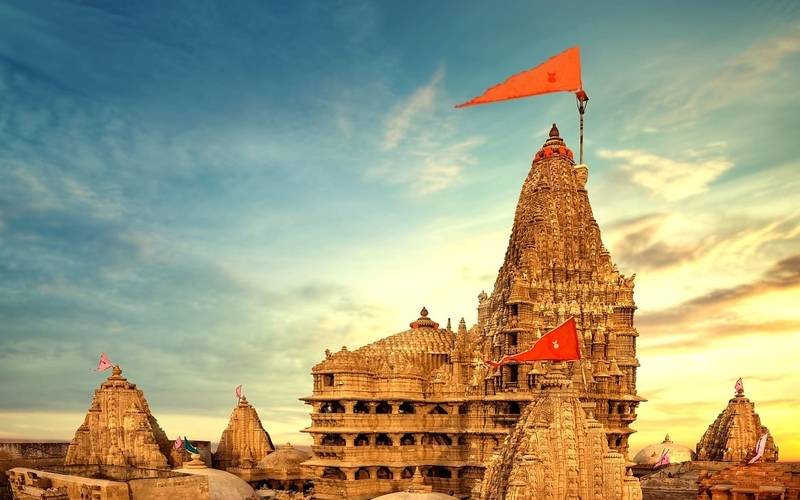

# Goutham Kumar Adunuri

I like travelling. I have travelled to a couple of states in India, and I would like to share my experience in Gujarat. We were on our way to Dwaraka, as it is an island in the Arabian Sea we need to go there on a ship. It was a plesant evening, beautiful sunset over the sea, Seagulls were flying everywhere over us. It was really an ammazing view. The main point of attraction here was that, they sell food for those birds on the ship, and people generally throw them directly into the air and the birds would catch them and eat while flying. This was one of the best experiences that I had in that whole journey.

